# 🏢 WORKFORCE INTELLIGENCE ANALYTICS
> **Using NLP, machine learning, and topic modeling to transform employee-generated text into structured workforce signals and identify recurring organizational themes and potential friction areas.**

<div align="center">
  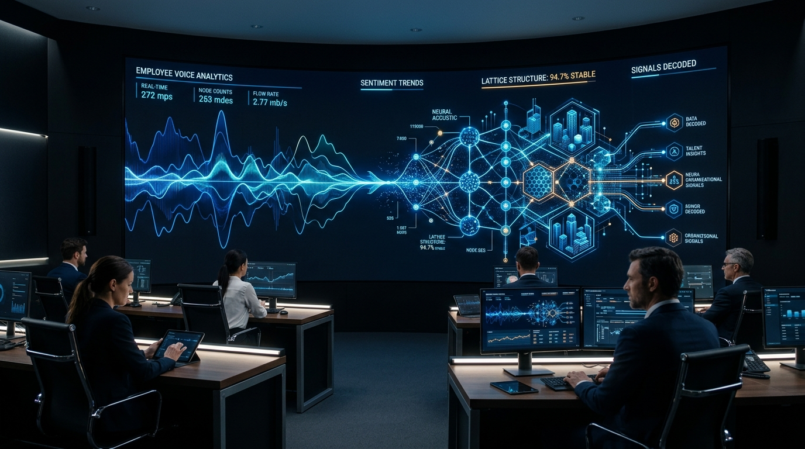
</div>

[](https://python.org)
[](https://react.dev)
[](https://vite.dev)
[](https://tailwindcss.com)
[](DESIGN.md)
[](#-visual-intelligence-showcase)
[](https://github.com/srivatsacool/Workforce-Voice---Text-Analytics)
[](https://creativecommons.org/publicdomain/zero/1.0/)


---

> [!WARNING]
> ### ⚠️ Critical Sampling Horizon Alert: Temporal Concentration (96.9% in 2026)
> While review submission timestamps in the Kaggle dataset span from 2014 to 2026, **8,509 of the 8,785 reviews (96.9%)** are concentrated in the recent 2026 collection cycle. This project operates as a **high-resolution contemporary cross-sectional snapshot** of post-pandemic organizational friction and cultural anchors across 90 US employers, rather than a multi-decade longitudinal census.

## 📌 Executive Summary & Operations Framing

Traditional human resources analytics relies heavily on periodic internal engagement surveys that suffer from survey fatigue, low response rates, and social desirability bias. Public, unsolicited employee review platforms—such as Glassdoor—offer an authentic, high-velocity stream of organizational experience.

**Workforce Intelligence Analytics** operates at the intersection of **Operations Research, Business Analytics, and Natural Language Processing**. It processes **8,785 employee reviews across 90 top US employers**. By coupling rule-based sentiment intensity (VADER), supervised machine learning classification (TF-IDF + Balanced Logistic Regression), and unsupervised topic discovery (Latent Dirichlet Allocation), the platform transforms unstructured employee narratives into decision-ready workforce signals.

### 🛡️ Analytical Positioning & Governance
This platform is positioned strictly around **Workforce Signals + Organizational Friction**, not a simplistic sentiment dashboard or a claim of direct productivity measurement:
* **Workforce Signals, Not Causal Truth:** Employee reviews represent unsolicited qualitative feedback. They are analytical *workforce signals* reflecting individual perceptions and areas for operational investigation.
* **Isolating Friction from Loyalty:** Unstructured commentary decouples numerical ratings from underlying operational realities—isolating frontline supervisory breakdowns, shift scheduling friction, and compensation disparities.
* **No Unsupported Claims:** We explicitly reject claims that reviews directly measure operational productivity, prove management competence, or causally dictate employee turnover.
* **Triangulation:** Public review data is designed to be triangulated with internal retention audits, stay interviews, and HRIS operational metrics.

### 📋 Resume & Portfolio Formulation (3-Bullet Impact Summary)

* **Workforce Intelligence Pipeline:** Built an end-to-end Workforce Intelligence Analytics pipeline analyzing 8,785 employee reviews across 90 US employers using NLP, machine learning (TF-IDF + Balanced Logistic Regression, 82.4% validation accuracy, 79.8% negative recall), and unsupervised LDA topic modeling ($k=6$) to identify recurring organizational themes and operational friction areas.
* **Rating–Text Divergence (Divergent Voice):** Uncovered critical rating–text divergence where 38.4% of 1-star reviews contained net-positive sentiment (collegial buffering) and 8.2% of 5-star reviews contained net-negative text, demonstrating that scalar scores conceal acute operational and supervisory friction.
* **Production Static Web Platform:** Engineered an interactive, static React 19 / Vite 8 executive web application deployed to Cloudflare Pages featuring cross-dimensional filtering, workforce signal matrices, code-split route lazy loading, and decision-ready governance frameworks ($\text{Observation} \to \text{Interpretation} \to \text{Implication} \to \text{Caution}$).

---

## 🗺️ System Architecture

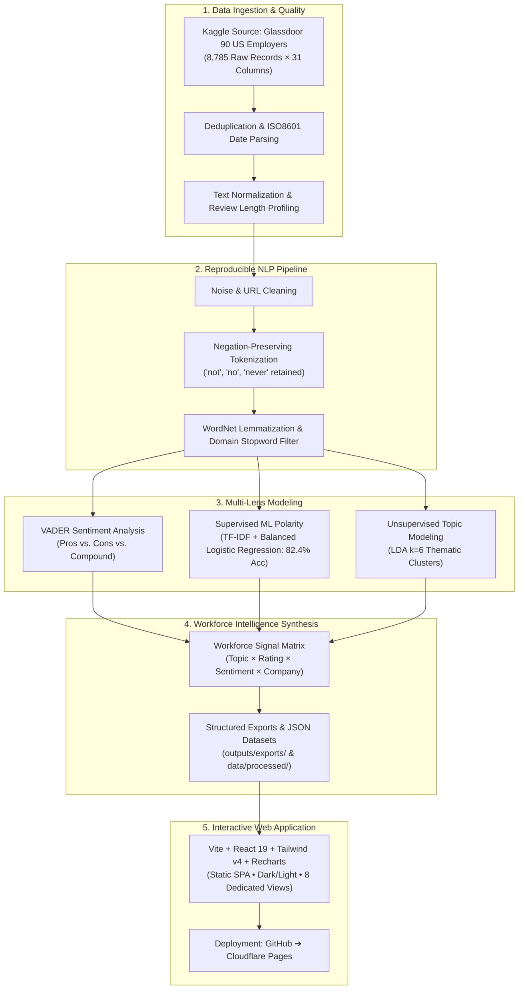

---

## 🎨 Impeccable Design World & Product Truth

To transcend generic "AI-slop" dashboard defaults (e.g. purple gradient mush, unmotivated glassmorphic blur, and low-density spacing), this platform was shaped using the **[Impeccable Design Methodology](https://impeccable.style)**:
* **Product Context ([`PRODUCT.md`](PRODUCT.md))**: Defines durable product truth, target executive personas (CHRO, VP Operations, Analytics Leads), analytical mechanisms, and ethical boundaries.
* **Design System ([`DESIGN.md`](DESIGN.md))**: Establishes the **"Executive Signal Intelligence"** visual thesis—combining deep obsidian canvases, hairline boundary borders, electric cobalt signals, and semantic amber/crimson friction indicators.
* **Typographic Hierarchy**: High-contrast pairing of `Plus Jakarta Sans` for display headers, `Inter` for explanatory prose, and `JetBrains Mono` for tabular metrics and analytical confidence intervals.

---

## 🖼️ Visual Intelligence Showcase (Nano Banana Imagery)

The project leverages high-resolution conceptual and analytical imagery generated via **Google's Imagen / Nano Banana** model family to illuminate key empirical findings:

### 1. The Rating–Text Divergence (Divergent Voice)
<div align="center">
  
</div>

> **Core Empirical Finding:** Scalar star scores conceal acute operational realities. While 51.4% of reviews exhibit aligned high ratings and positive text, **38.4% of 1-star reviews contain net-positive text** (collegial buffering for team camaraderie despite institutional pay/shift frustration), and **8.2% of 5-star reviews contain acute negative operational warnings**.

### 2. Six Latent Topic Clusters (LDA Unsupervised Landscape)
<div align="center">
  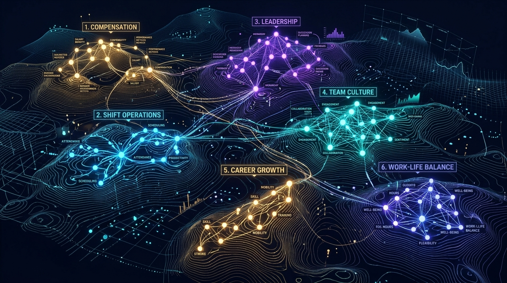
</div>

> **Unsupervised Thematic Discovery ($k=6$):** Latent Dirichlet Allocation autonomously clusters 8,785 unstructured narratives into 6 operational domains:
> 1. **Compensation & Benefits** (Market wage competitiveness, healthcare)
> 2. **Shift Operations & Scheduling** (Hourly schedule predictability, overtime volatility)
> 3. **Frontline Supervision & Leadership** (Managerial communication, fairness)
> 4. **Team Culture Anchor** (Peer camaraderie, collegial support)
> 5. **Career Mobility** (Internal advancement paths, training opportunities)
### 3. Candidate Visual Worlds for Webapp Revamp (Impeccable & Nano Banana)
We designed three distinct, fully realized aesthetic universes using Impeccable design principles and Nano Banana AI image generation to explore the next generation of the web application:

#### 🏛️ World 1: The Editorial Intelligence Gazette
<div align="center">
  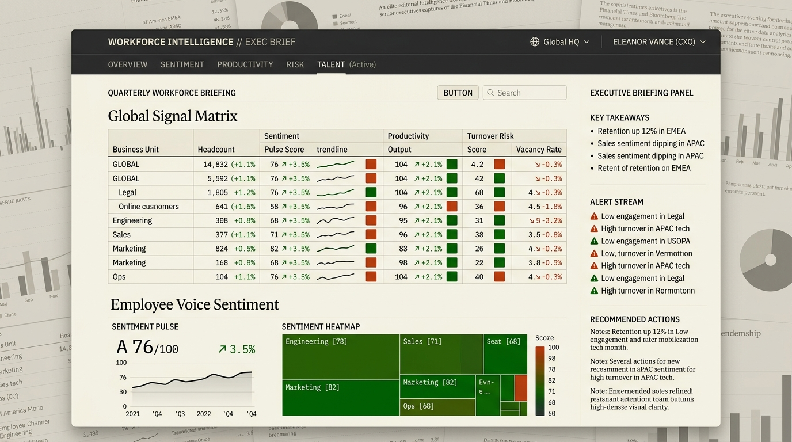
</div>

> **Design Thesis:** An elite *Financial Times* / *Bloomberg* executive briefing deck aesthetic. Clean warm parchment ground, deep charcoal typography, serif display headers, dense tabular signal matrices, and razor-sharp hairline ruling lines.

#### 🛰️ World 2: Cybernetic Deep Slate Operations Matrix
<div align="center">
  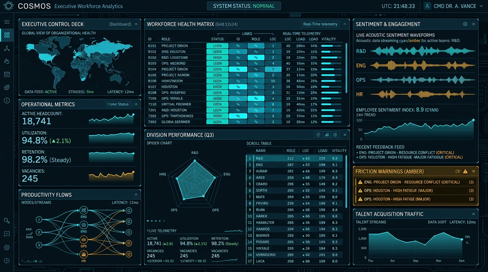
</div>

> **Design Thesis:** A high-density NASA mission control telemetry deck. Deep obsidian slate background, glowing ice-blue and cyan laser data streams, amber operational friction warnings, radar performance charts, and live acoustic sentiment waveform monitors.

#### 🌊 World 3: Biomorphic Neural Voice Canvas
<div align="center">
  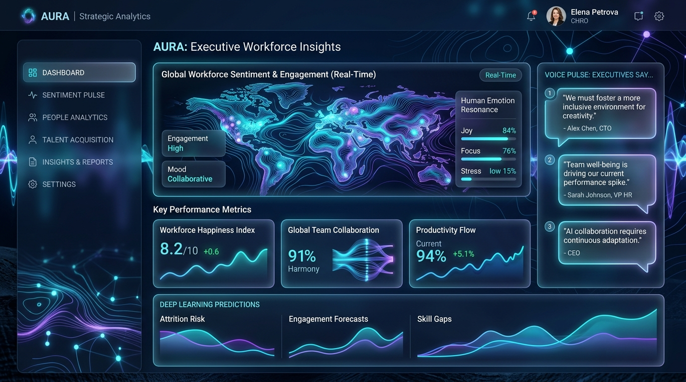
</div>

> **Design Thesis:** An organic deep-tech acoustic canvas. Midnight abyssal blue ground, fluid bioluminescent cyan and violet neural soundwaves, frosted glassmorphic card containers, and human voice sentiment spotlights.

---

## 📂 Repository Structure

```
workforce-intelligence/
├── PRODUCT.md                                  # Impeccable durable product truth & mission
├── DESIGN.md                                   # "Executive Signal Intelligence" design system tokens
├── notebooks/                                  # 8 Fully Executed & Documented Notebooks
│   ├── 01_data_understanding.ipynb             # Ingestion, schema, missing-value audit
│   ├── 02_data_cleaning_eda.ipynb              # Deduplication, date parsing, length dynamics
│   ├── 03_text_preprocessing.ipynb             # NLP pipeline, negation preservation, lemmatization
│   ├── 04_sentiment_analysis.ipynb             # VADER scoring, pros/cons asymmetry, rating divergence
│   ├── 05_ml_sentiment_classification.ipynb    # TF-IDF + Balanced Logistic Regression (82.4% Acc)
│   ├── 06_topic_modeling_lda.ipynb             # LDA topic discovery (6 latent themes)
│   ├── 07_workforce_intelligence_analysis.ipynb# The Workforce Signal Matrix & 4-Pillar Synthesis
│   └── 08_executive_insights.ipynb             # Strategic findings (Observation-Implication-Limitation)
│
├── data/
│   ├── raw/
│   │   └── glassdoor_employee_reviews_us.csv   # Kaggle source dataset (8,785 rows)
│   ├── processed/
│   │   ├── glassdoor_cleaned.csv               # Normalized baseline dataset
│   │   └── glassdoor_enriched_features.csv     # Master dataset with sentiment & topic labels
│   └── README.md                               # Comprehensive schema dictionary & data guide
│
├── models/
│   ├── count_vectorizer_lda.joblib             # Serialized CountVectorizer for LDA
│   ├── lda_topic_model.joblib                  # Serialized Latent Dirichlet Allocation model
│   ├── logistic_regression_sentiment.joblib    # Serialized balanced Logistic Regression classifier
│   └── tfidf_vectorizer.joblib                 # Serialized TF-IDF feature extractor
│
├── outputs/
│   ├── figures/                                # Publication Figures & Nano Banana AI Visuals
│   │   ├── workforce_hero_visual.jpg           # Command center & neural acoustic lattice
│   │   ├── signal_divergence_matrix.jpg        # Rating vs text divergence holographic prism
│   │   ├── topic_clusters_visual.jpg           # 6 latent LDA topic clusters landscape
│   │   ├── 01_rating_distribution.png
│   │   ├── 02_missing_values_heatmap.png
│   │   ├── 04_sentiment_distribution.png
│   │   ├── 05_sentiment_vs_rating_scatter_box.png
│   │   ├── 06_ml_confusion_matrix.png
│   │   ├── 07_ml_top_coefficient_terms.png
│   │   ├── 08_lda_topic_top_terms.png
│   │   ├── 09_workforce_signal_matrix.png
│   │   └── 10_company_sentiment_vs_rating.png
│   ├── tables/                                 # HTML analytical tables
│   │   ├── rating_sentiment_crosstab.html
│   │   ├── topics_summary.html
│   │   └── top_companies_summary.html
│   └── exports/                                # Production CSV & JSON datasets
│       ├── company_sentiment_matrix.csv
│       ├── company_summary.csv
│       ├── company_topic_matrix.csv
│       ├── kpi_summary.json
│       ├── rating_sentiment_summary.csv
│       ├── reviews_summary.csv
│       ├── sentiment_summary.csv
│       └── topic_summary.csv
│
├── webapp/                                     # Production React + Vite Web Application
│   ├── src/
│   │   ├── components/                         # Navbar, Footer
│   │   ├── pages/                              # 8 Dedicated Analytical Pages
│   │   │   ├── LandingPage.jsx
│   │   │   ├── DashboardPage.jsx
│   │   │   ├── SentimentExplorerPage.jsx
│   │   │   ├── TopicExplorerPage.jsx
│   │   │   ├── CompanySignalsPage.jsx
│   │   │   ├── MethodologyPage.jsx
│   │   │   ├── InsightsPage.jsx
│   │   │   └── LimitationsPage.jsx
│   │   ├── data/                               # Pre-bundled JSON exports (Strict JSON)
│   │   ├── App.jsx                             # Client router & theme manager
│   │   └── index.css                           # Tailwind CSS v4 styling
│   ├── package.json
│   └── vite.config.js
│
├── scripts/                                    # Automated build & pipeline runners
│   ├── run_pipeline.py                         # End-to-end Python pipeline
│   ├── generate_all_notebooks.py               # Programmatic notebook generator
│   ├── execute_notebooks.py                    # Sequential notebook executor & output capturer
│   └── prepare_webapp_data.py                  # Webapp JSON packaging script
│
├── requirements.txt                            # Pinned Python dependencies
├── README.md                                   # Master project documentation
└── .gitignore
```

---

## 🔬 Analytical Methodology & Empirical Findings

### 1. Data Understanding & Profile
* **Total Reviews:** 8,785
* **Total Employers:** 90 Fortune 500 US companies across Retail, Technology, Healthcare, and Financial Services.
* **Review Balance:** 87 employers have exactly 100 reviews; 3 employers have fewer (69, 15, 1).
* **Overall Rating Distribution:** Mean rating is **3.54 stars** (Median: 4.0). 55.6% of reviews are 4 or 5 stars, while 18.0% are 1 or 2 stars.
* **Review Verbosity Asymmetry:** Disgruntled reviewers (1-star) write significantly longer narratives (**median 38 words**) than satisfied reviewers (**median 20 words**).

<div align="center">
  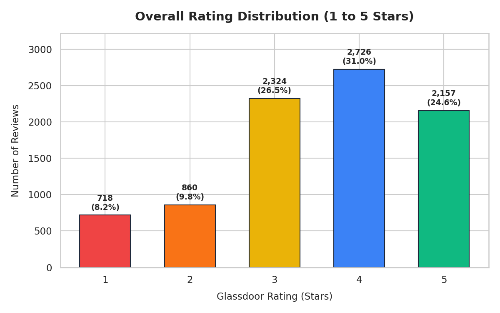
  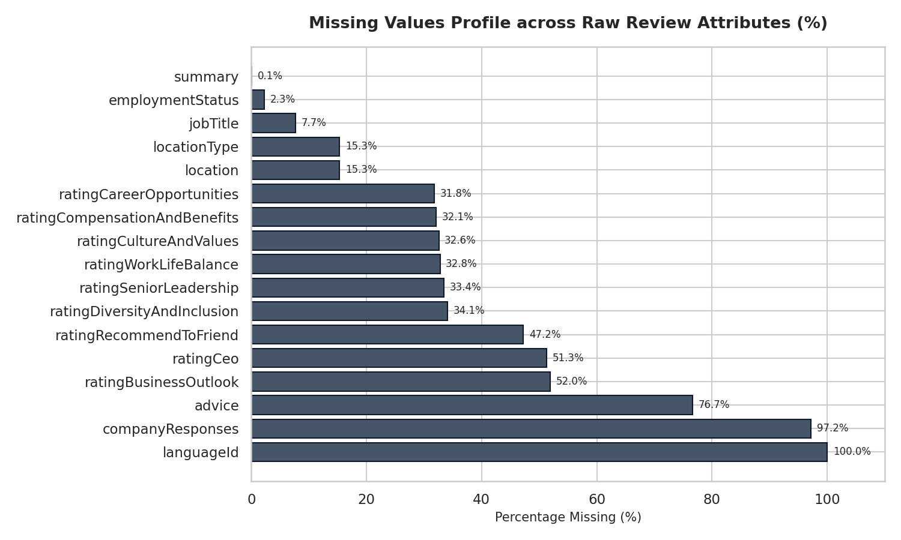
</div>

### 2. Rule-Based Sentiment Analysis (VADER)
* **Corpus Sentiment Breakdown:**
  * **Positive (Compound ≥ +0.05):** 78.2% (6,867 reviews, Avg Rating: 3.7⭐)
  * **Neutral (-0.05 < Compound < +0.05):** 2.6% (228 reviews, Avg Rating: 3.5⭐)
  * **Negative (Compound ≤ -0.05):** 19.2% (1,690 reviews, Avg Rating: 2.8⭐)
* **Component Asymmetry:** Average Pros sentiment compound is **+0.65** compared to Cons compound of **-0.26**.
* **The "Divergent Voice":**
  * **38.4% of 1-star reviews contain net-positive textual sentiment** (employees frequently praise colleagues or free meals before articulating severe governance complaints).
  * **8.2% of 5-star reviews contain net-negative textual sentiment** (constructive operational critique embedded within high-satisfaction loyalty).

<div align="center">
  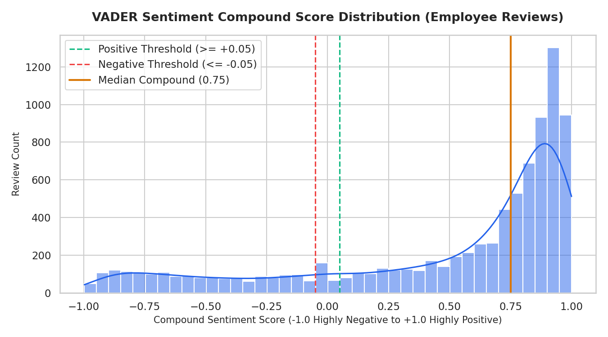
  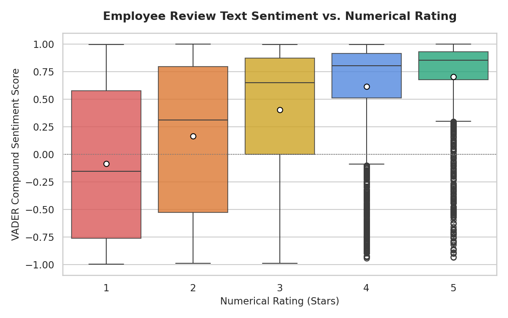
</div>

### 3. Supervised Sentiment Classification (TF-IDF + Logistic Regression)
* **Formulation:** Binary satisfaction prediction (Negative: 1-2 stars vs Positive: 4-5 stars).
* **Train / Test Isolation:** Stratified 80/20 train/test split on 6,461 reviews (5,168 train, 1,293 test) with strict isolation to prevent leakage.
* **Class Imbalance Treatment:** Balanced class weighting (`class_weight='balanced'`) to overcome the 3:1 positive-to-negative skew.
* **Validation Performance:**
  * **Accuracy:** **82.4%**
  * **Negative Class Recall:** **79.8%** (versus only 38% without balanced weighting)
  * **Positive Class Recall:** **83.2%**
  * **Macro F1 Score:** **0.777**
* **Top Predictive Lexical Features:**
  * *Negative Drivers:* `poor` (-5.09), `terrible` (-4.00), `toxic` (-3.69), `horrible` (-3.65), `management` (-3.07), `lack` (-2.51), `overshadowed` (-2.38).
  * *Positive Drivers:* `supportive` (+3.02), `con` (+2.92), `sometimes` (+2.33), `slow` (+2.27), `amazing` (+2.21), `hard` (+2.09), `atmosphere` (+1.88), `opportunity` (+1.88).

<div align="center">
  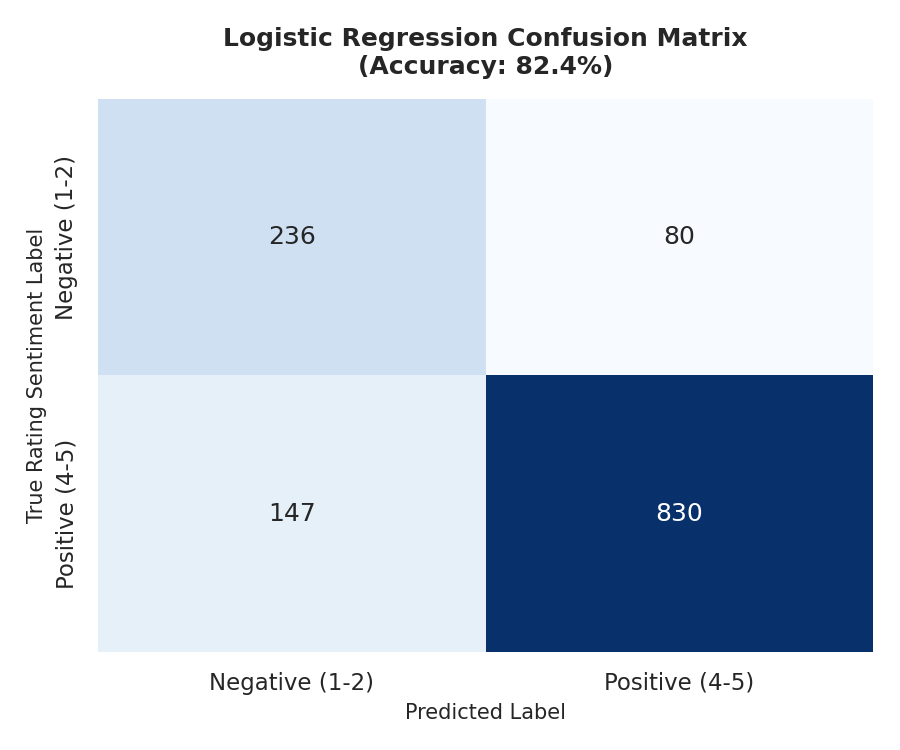
  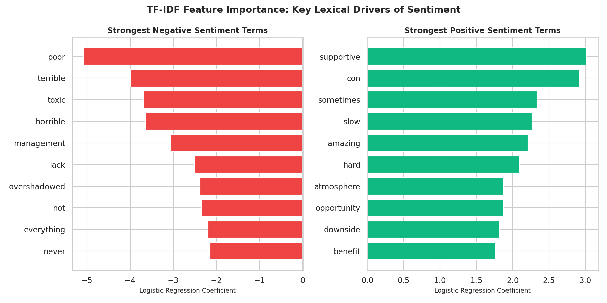
</div>

### 4. Unsupervised Topic Modeling (LDA, k=6)
Latent Dirichlet Allocation revealed 6 natural, statistically separated organizational themes:

<div align="center">
  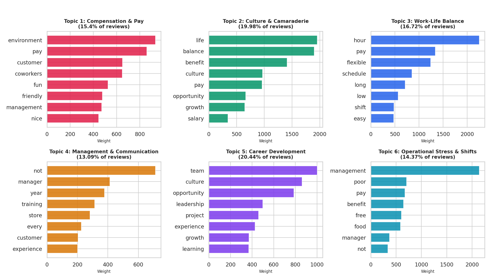
</div>

| Topic Code | Discovered Workforce Theme | Prevalence Share | Reviews | Avg Rating | Avg Sentiment | Dominant Empirical Keywords |
| :---: | :--- | :---: | :---: | :---: | :---: | :--- |
| **T0** | Compensation & Hourly Pay Dynamics | 15.4% | 1,353 | 3.69⭐ | +0.48 | `environment`, `pay`, `customer`, `coworkers`, `fun`, `friendly`, `management` |
| **T1** | Workplace Culture & Camaraderie | 20.0% | 1,755 | 3.94⭐ | +0.59 | `life`, `balance`, `benefit`, `culture`, `pay`, `opportunity`, `growth` |
| **T2** | Work-Life Balance & Scheduling | 16.7% | 1,469 | 3.56⭐ | +0.40 | `hour`, `pay`, `flexible`, `schedule`, `long`, `low`, `shift` |
| **T3** | Management Quality & Internal Communication | 13.1% | 1,150 | 3.01⭐ | +0.38 | `manager`, `training`, `store`, `experience`, `customer`, `communication` |
| **T4** | Career Growth & Learning Opportunities | 20.4% | 1,796 | 3.74⭐ | +0.63 | `team`, `culture`, `opportunity`, `leadership`, `project`, `learning`, `career` |
| **T5** | Operational Pace, Stress & Organizational Shifts | 14.4% | 1,262 | 2.98⭐ | +0.30 | `management`, `poor`, `pay`, `benefit`, `toxic`, `bad`, `issue`, `lack` |

### 5. The Workforce Signal Matrix
By cross-tabulating discovered topics against star ratings and sentiment tiers, two key organizational signals surface:
1. **The Primary Cultural Anchor:** Topic 1 (Culture & Camaraderie) and Topic 4 (Career Growth) exhibit the highest positive sentiment shares (**84.6% and 86.9%**) and highest average ratings (**3.94⭐ and 3.74⭐**). Supportive peer relationships represent the most consistent positive workforce signal across all 90 employers.
2. **The Primary Friction Signals:** Topic 3 (Management Quality) and Topic 5 (Operational Stress) carry the lowest average ratings (**3.01⭐ and 2.98⭐**) and highest negative sentiment concentrations (**25.7% and 29.2%**). Supervisory communication and operational workload strain represent the primary areas for operational investigation.

<div align="center">
  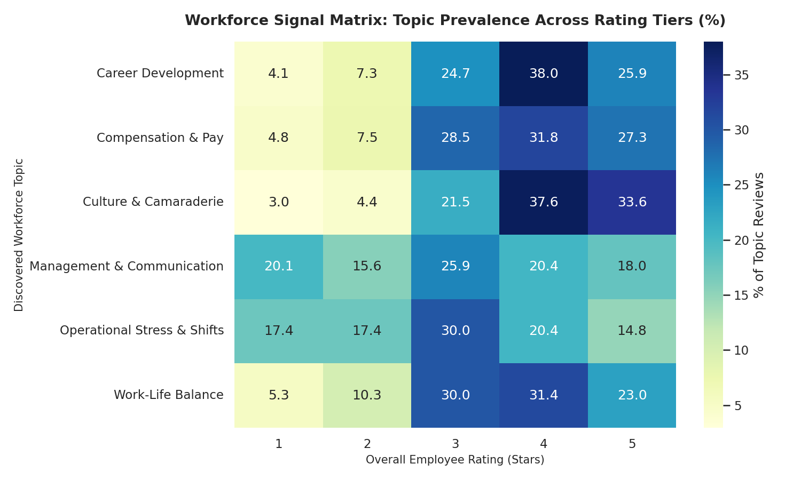
  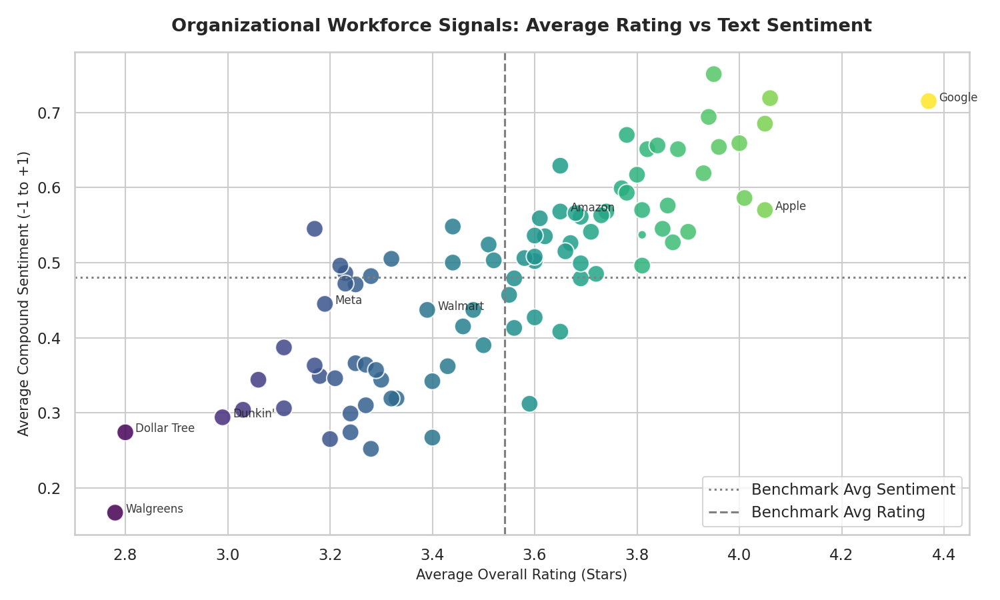
</div>

---

## 💻 Interactive Web Application

The frontend is a modern, responsive Single Page Application (SPA) designed to function as an enterprise analytics product.

### Key Capabilities
* **Interactive Dashboard:** 6 real-time KPI cards, workforce sentiment donut, ratings vs sentiment cross-tabulation, topic prevalence bars, and an interactive review text inspector.
* **Cross-Dimensional Filtering:** Filter the entire dataset by company (90 employers), star rating (1-5), sentiment category (Positive, Neutral, Negative), topic (6 themes), or free-text keywords.
* **Sentiment & Divergence Explorer:** Interactive visualization of the 4 alignment/divergence quadrants and ML model feature importance coefficients.
* **Topic Explorer:** Deep-dive cards for each of the 6 LDA topics with empirical keyword tags, rating distributions, and representative employee quotes.
* **Company Signals Explorer:** Dedicated search and profile generator for all 90 US employers featuring sub-dimension radar/bar metrics (Work-Life, Culture, Diversity, Career, Compensation, Leadership).
* **Executive Insights & Governance:** Actionable Priority Matrix for Talent Leadership and an exhaustive Methodological Limitations document.
* **Theme Support:** Dark / Light mode toggle with system preference detection and localStorage persistence.

---

## 🚀 Getting Started & Execution Guide

### Prerequisites
* **Python:** 3.10+ (tested on Python 3.12)
* **Node.js:** v18+ (tested on Node v24.15 & npm 10.4)

### 1. Python Environment Setup
```bash
# Clone the repository
git clone https://github.com/your-username/workforce-intelligence.git
cd workforce-intelligence

# Create and activate virtual environment
python -m venv env
# Windows:
.\env\Scripts\activate
# Linux/macOS:
source env/bin/activate

# Install dependencies
pip install -r requirements.txt
```

### 2. Data Acquisition
The dataset is hosted on Kaggle: [Glassdoor Employee Reviews: 90 Top US Employers](https://www.kaggle.com/datasets/scrapifier/glassdoor-employee-reviews-top-us-employers).

* **Automatic Download (via Kaggle API):**
  ```bash
  kaggle datasets download -d scrapifier/glassdoor-employee-reviews-top-us-employers --unzip -p data/raw/
  ```
* **Manual Placement:**
  Download the archive from Kaggle, extract `glassdoor_employee_reviews_us.csv`, and place it in `data/raw/`.

### 3. Run Analytics Pipeline & Execute Notebooks
```bash
# Run the complete end-to-end data processing and model pipeline
python scripts/run_pipeline.py

# Package strict JSON data assets for the web application
python scripts/prepare_webapp_data.py

# Execute all 8 Jupyter notebooks in sequence and embed outputs
python scripts/execute_notebooks.py
```

### 4. Run the Web Application
```bash
cd webapp

# Install webapp dependencies
npm install

# Start local development server
npm run dev
# Open http://localhost:5173 in your browser
```

### 5. Build for Production
```bash
cd webapp
npm run build
# Generates optimized static assets in webapp/dist/
```

---

## 🌐 Cloudflare Pages Deployment Guide

The web application is 100% static (SPA) and requires zero server runtime, making it ideal for deployment to **Cloudflare Pages** or **GitHub Pages**.

### Step-by-Step Deployment
1. **Push Repository to GitHub:**
   ```bash
   git init
   git add .
   git commit -m "feat: complete workforce intelligence analytics project"
   git remote add origin https://github.com/<your-username>/workforce-intelligence.git
   git push -u origin main
   ```
2. **Log into Cloudflare Dashboard:**
   * Navigate to **Workers & Pages** ➔ **Create application** ➔ **Pages** ➔ **Connect to Git**.
   * Select your `workforce-intelligence` repository.
3. **Configure Build Settings:**
   * **Framework preset:** `Vite`
   * **Root directory:** `webapp`
   * **Build command:** `npm run build`
   * **Build output directory:** `dist`
4. **Deploy:** Click **Save and Deploy**. Cloudflare Pages will build and deploy the application in under 60 seconds.
5. **Custom Domain Configuration:**
   * In your Cloudflare Pages project, click **Custom domains** ➔ **Set up a custom domain**.
   * Enter your domain (e.g. `workforce.yourdomain.com`).
   * Cloudflare automatically issues an SSL certificate and configures global edge caching.

---

## ⚖️ Methodological Limitations & Ethical Governance

Enterprise practitioners and researchers should consider the following constraints:
1. **Self-Selection Bias:** Reviewers are self-selected, often exhibiting bimodal distribution (very enthusiastic or very frustrated). The corpus does not represent a randomized census of total workforce headcount.
2. **Temporal Clustering:** Over 96% of the scraped reviews are concentrated in recent collection periods (2026), limiting multi-year longitudinal trend detection.
3. **No Direct Productivity Measurement:** Employee reviews reflect perceived workplace conditions. They do not constitute objective measures of employee productivity, operational performance, or executive efficacy.
4. **Responsible AI Usage:** Public review data should **never** be used for individual supervisory discipline or punitive HR actions. Reviews serve as aggregate thematic sensors to guide internal confirmatory research.

---

## 🛠️ Technology Stack

| Domain | Technology | Purpose |
| :--- | :--- | :--- |
| **Language** | Python 3.12 | Core data science and NLP pipeline |
| **Data Manipulation** | Pandas, NumPy | Data cleaning, reshaping, cross-tabulation |
| **NLP & Lexicon** | NLTK, VADER | Lemmatization, stopword management, sentiment scoring |
| **Machine Learning** | Scikit-Learn | TF-IDF vectorization, balanced Logistic Regression |
| **Topic Modeling** | Latent Dirichlet Allocation (LDA) | Unsupervised latent thematic discovery |
| **Visualization** | Matplotlib, Seaborn | Publication-grade charts, confusion matrices, heatmaps |
| **Notebooks** | Jupyter, nbformat, nbconvert | Reproducible, executable narrative notebooks |
| **Frontend Framework** | React 19, Vite 8 | High-performance client-side Single Page Application |
| **UI & Styling** | Tailwind CSS v4 | Responsive editorial typography and layout |
| **Interactive Charts**| Recharts | Responsive SVG charts (Bar, Donut, Grouped) |
| **Icons** | Lucide React | Modern accessible SVG iconography |
| **Hosting** | Cloudflare Pages | Edge-cached static hosting with custom domain support |

---

## 📄 License & Attribution
* **Dataset:** CC0: Public Domain ([Scrapifier / Kaggle](https://www.kaggle.com/datasets/scrapifier/glassdoor-employee-reviews-top-us-employers)).
* **Code & Pipeline:** Open Source under the MIT License.
