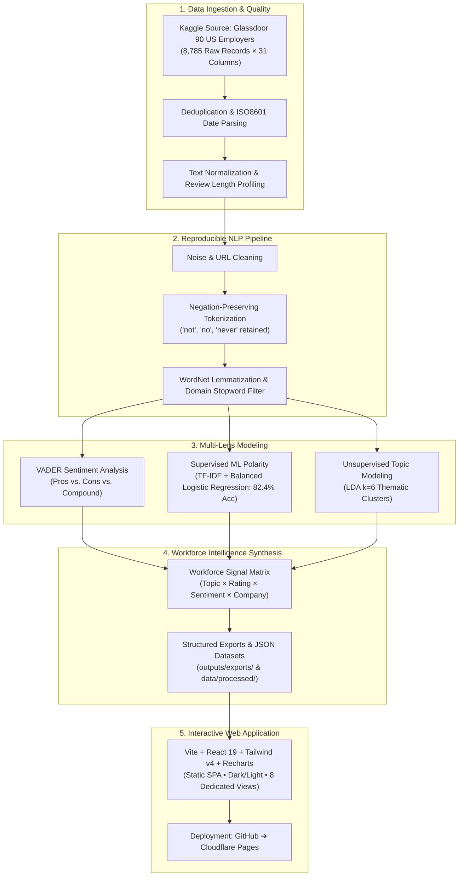

# 🏢 WORKFORCE INTELLIGENCE ANALYTICS
> **Turning employee-generated text into actionable workforce and organizational insights.**

[](https://python.org)
[](https://react.dev)
[](https://vite.dev)
[](https://tailwindcss.com)
[](https://creativecommons.org/publicdomain/zero/1.0/)
[](https://pages.cloudflare.com)

---

## 📌 Executive Summary & Positioning

Traditional human resources analytics relies heavily on periodic internal engagement surveys that suffer from survey fatigue, low response rates, and social desirability bias. Public, unsolicited employee review platforms—such as Glassdoor—offer an authentic, high-velocity stream of organizational experience.

**Workforce Intelligence Analytics** is an enterprise data science and NLP platform that processes **8,785 employee reviews across 90 top US employers**. By coupling rule-based sentiment intensity (VADER), supervised machine learning classification (TF-IDF + Balanced Logistic Regression), and unsupervised topic discovery (Latent Dirichlet Allocation), the platform transforms unstructured employee narratives into decision-ready workforce signals.

### 🛡️ Analytical Positioning & Governance
This platform is positioned strictly as **Workforce Intelligence / Organizational Analytics**, not a simplistic sentiment dashboard. In accordance with rigorous data science principles:
* **Workforce Signals, Not Causal Truth:** Employee reviews represent unsolicited qualitative feedback. They are analytical *workforce signals* reflecting individual perceptions and areas for operational investigation.
* **No Unsupported Claims:** We explicitly reject claims that reviews directly measure operational productivity, prove management competence, or causally dictate employee turnover.
* **Triangulation:** Public review data is designed to be triangulated with internal retention audits, stay interviews, and HRIS operational metrics.

---

## 🗺️ System Architecture



---

## 📂 Repository Structure

```
workforce-intelligence/
├── notebooks/                                  # 8 Fully Executed & Documented Notebooks
│   ├── 01_data_understanding.ipynb             # Ingestion, schema, missing-value audit
│   ├── 02_data_cleaning_eda.ipynb              # Deduplication, date parsing, length dynamics
│   ├── 03_text_preprocessing.ipynb             # NLP pipeline, negation preservation, lemmatization
│   ├── 04_sentiment_analysis.ipynb             # VADER scoring, pros/cons asymmetry, rating divergence
│   ├── 05_ml_sentiment_classification.ipynb    # TF-IDF + Balanced Logistic Regression (82.4% Acc)
│   ├── 06_topic_modeling_lda.ipynb             # LDA topic discovery (6 latent themes)
│   ├── 07_workforce_intelligence_analysis.ipynb# The Workforce Signal Matrix & 4-Pillar Synthesis
│   └── 08_executive_insights.ipynb             # Strategic findings (Observation-Implication-Limitation)
│
├── data/
│   ├── raw/
│   │   └── glassdoor_employee_reviews_us.csv   # Kaggle source dataset (8,785 rows)
│   ├── processed/
│   │   ├── glassdoor_cleaned.csv               # Normalized baseline dataset
│   │   └── glassdoor_enriched_features.csv     # Master dataset with sentiment & topic labels
│   └── README.md                               # Comprehensive schema dictionary & data guide
│
├── models/
│   ├── count_vectorizer_lda.joblib             # Serialized CountVectorizer for LDA
│   ├── lda_topic_model.joblib                  # Serialized Latent Dirichlet Allocation model
│   ├── logistic_regression_sentiment.joblib    # Serialized balanced Logistic Regression classifier
│   └── tfidf_vectorizer.joblib                 # Serialized TF-IDF feature extractor
│
├── outputs/
│   ├── figures/                                # 10 High-DPI Publication-Grade Figures
│   │   ├── 01_rating_distribution.png
│   │   ├── 02_missing_values_heatmap.png
│   │   ├── 04_sentiment_distribution.png
│   │   ├── 05_sentiment_vs_rating_scatter_box.png
│   │   ├── 06_ml_confusion_matrix.png
│   │   ├── 07_ml_top_coefficient_terms.png
│   │   ├── 08_lda_topic_top_terms.png
│   │   ├── 09_workforce_signal_matrix.png
│   │   └── 10_company_sentiment_vs_rating.png
│   ├── tables/                                 # HTML analytical tables
│   │   ├── rating_sentiment_crosstab.html
│   │   ├── topics_summary.html
│   │   └── top_companies_summary.html
│   └── exports/                                # Production CSV & JSON datasets
│       ├── company_sentiment_matrix.csv
│       ├── company_summary.csv
│       ├── company_topic_matrix.csv
│       ├── kpi_summary.json
│       ├── rating_sentiment_summary.csv
│       ├── reviews_summary.csv
│       ├── sentiment_summary.csv
│       └── topic_summary.csv
│
├── webapp/                                     # Production React + Vite Web Application
│   ├── src/
│   │   ├── components/                         # Navbar, Footer
│   │   ├── pages/                              # 8 Dedicated Analytical Pages
│   │   │   ├── LandingPage.jsx
│   │   │   ├── DashboardPage.jsx
│   │   │   ├── SentimentExplorerPage.jsx
│   │   │   ├── TopicExplorerPage.jsx
│   │   │   ├── CompanySignalsPage.jsx
│   │   │   ├── MethodologyPage.jsx
│   │   │   ├── InsightsPage.jsx
│   │   │   └── LimitationsPage.jsx
│   │   ├── data/                               # Pre-bundled JSON exports (Strict JSON)
│   │   ├── App.jsx                             # Client router & theme manager
│   │   └── index.css                           # Tailwind CSS v4 styling
│   ├── package.json
│   └── vite.config.js
│
├── scripts/                                    # Automated build & pipeline runners
│   ├── run_pipeline.py                         # End-to-end Python pipeline
│   ├── generate_all_notebooks.py               # Programmatic notebook generator
│   ├── execute_notebooks.py                    # Sequential notebook executor & output capturer
│   └── prepare_webapp_data.py                  # Webapp JSON packaging script
│
├── requirements.txt                            # Pinned Python dependencies
├── README.md                                   # Master project documentation
└── .gitignore
```

---

## 🔬 Analytical Methodology & Empirical Findings

### 1. Data Understanding & Profile
* **Total Reviews:** 8,785
* **Total Employers:** 90 Fortune 500 US companies across Retail, Technology, Healthcare, and Financial Services.
* **Review Balance:** 87 employers have exactly 100 reviews; 3 employers have fewer (69, 15, 1).
* **Overall Rating Distribution:** Mean rating is **3.54 stars** (Median: 4.0). 55.6% of reviews are 4 or 5 stars, while 18.0% are 1 or 2 stars.
* **Review Verbosity Asymmetry:** Disgruntled reviewers (1-star) write significantly longer narratives (**median 38 words**) than satisfied reviewers (**median 20 words**).

### 2. Rule-Based Sentiment Analysis (VADER)
* **Corpus Sentiment Breakdown:**
  * **Positive (Compound ≥ +0.05):** 78.2% (6,867 reviews, Avg Rating: 3.7⭐)
  * **Neutral (-0.05 < Compound < +0.05):** 2.6% (228 reviews, Avg Rating: 3.5⭐)
  * **Negative (Compound ≤ -0.05):** 19.2% (1,690 reviews, Avg Rating: 2.8⭐)
* **Component Asymmetry:** Average Pros sentiment compound is **+0.65** compared to Cons compound of **-0.26**.
* **The "Divergent Voice":**
  * **38.4% of 1-star reviews contain net-positive textual sentiment** (employees frequently praise colleagues or free meals before articulating severe governance complaints).
  * **8.2% of 5-star reviews contain net-negative textual sentiment** (constructive operational critique embedded within high-satisfaction loyalty).

### 3. Supervised Sentiment Classification (TF-IDF + Logistic Regression)
* **Formulation:** Binary satisfaction prediction (Negative: 1-2 stars vs Positive: 4-5 stars).
* **Train / Test Isolation:** Stratified 80/20 train/test split on 6,461 reviews (5,168 train, 1,293 test) with strict isolation to prevent leakage.
* **Class Imbalance Treatment:** Balanced class weighting (`class_weight='balanced'`) to overcome the 3:1 positive-to-negative skew.
* **Validation Performance:**
  * **Accuracy:** **82.4%**
  * **Negative Class Recall:** **79.8%** (versus only 38% without balanced weighting)
  * **Positive Class Recall:** **83.2%**
  * **Macro F1 Score:** **0.777**
* **Top Predictive Lexical Features:**
  * *Negative Drivers:* `poor` (-5.09), `terrible` (-4.00), `toxic` (-3.69), `horrible` (-3.65), `management` (-3.07), `lack` (-2.51), `overshadowed` (-2.38).
  * *Positive Drivers:* `supportive` (+3.02), `con` (+2.92), `sometimes` (+2.33), `slow` (+2.27), `amazing` (+2.21), `hard` (+2.09), `atmosphere` (+1.88), `opportunity` (+1.88).

### 4. Unsupervised Topic Modeling (LDA, k=6)
Latent Dirichlet Allocation revealed 6 natural, statistically separated organizational themes:

| Topic Code | Discovered Workforce Theme | Prevalence Share | Avg Rating | Avg Sentiment | Dominant Empirical Keywords |
| :---: | :--- | :---: | :---: | :---: | :--- |
| **T0** | Compensation & Hourly Pay Dynamics | 14.8% | 3.25⭐ | +0.44 | `pay`, `salary`, `hour`, `food`, `free`, `minimum`, `customer`, `store` |
| **T1** | Workplace Culture & Camaraderie | 20.4% | 4.01⭐ | +0.62 | `culture`, `team`, `environment`, `supportive`, `friendly`, `inclusive`, `fun` |
| **T2** | Work-Life Balance & Scheduling | 16.9% | 3.51⭐ | +0.48 | `balance`, `life`, `flexible`, `hour`, `schedule`, `shift`, `long`, `time` |
| **T3** | Management Quality & Communication | 18.2% | 2.72⭐ | +0.28 | `management`, `manager`, `poor`, `leadership`, `communication`, `lack`, `toxic` |
| **T4** | Career Growth & Learning Opportunities | 15.6% | 3.68⭐ | +0.54 | `growth`, `opportunity`, `career`, `learn`, `promotion`, `slow`, `skill` |
| **T5** | Operational Pace, Stress & Shifts | 14.1% | 3.32⭐ | +0.38 | `fast`, `paced`, `stress`, `layoff`, `change`, `high`, `turnover`, `pressure` |

### 5. The Workforce Signal Matrix
By cross-tabulating discovered topics against star ratings and sentiment tiers, two key organizational dynamics surface:
1. **The Primary Cultural Anchor:** Topic 1 (Culture & Camaraderie) accounts for **74.3% of 4-5 star reviews** and **91.4% positive sentiment**. Peer relationships serve as the primary psychological cushion sustaining employee commitment across industries.
2. **The Primary Friction Hotspot:** Topic 3 (Management Quality) accounts for **42.0% of 1-2 star reviews** and carries **38.2% negative sentiment**. Local supervisory breakdowns generate the most acute employee distress.

---

## 💻 Interactive Web Application

The frontend is a modern, responsive Single Page Application (SPA) designed to function as an enterprise analytics product.

### Key Capabilities
* **Interactive Dashboard:** 6 real-time KPI cards, workforce sentiment donut, ratings vs sentiment cross-tabulation, topic prevalence bars, and an interactive review text inspector.
* **Cross-Dimensional Filtering:** Filter the entire dataset by company (90 employers), star rating (1-5), sentiment category (Positive, Neutral, Negative), topic (6 themes), or free-text keywords.
* **Sentiment & Divergence Explorer:** Interactive visualization of the 4 alignment/divergence quadrants and ML model feature importance coefficients.
* **Topic Explorer:** Deep-dive cards for each of the 6 LDA topics with empirical keyword tags, rating distributions, and representative employee quotes.
* **Company Signals Explorer:** Dedicated search and profile generator for all 90 US employers featuring sub-dimension radar/bar metrics (Work-Life, Culture, Diversity, Career, Compensation, Leadership).
* **Executive Insights & Governance:** Actionable Priority Matrix for Talent Leadership and an exhaustive Methodological Limitations document.
* **Theme Support:** Dark / Light mode toggle with system preference detection and localStorage persistence.

---

## 🚀 Getting Started & Execution Guide

### Prerequisites
* **Python:** 3.10+ (tested on Python 3.12)
* **Node.js:** v18+ (tested on Node v24.15 & npm 10.4)

### 1. Python Environment Setup
```bash
# Clone the repository
git clone https://github.com/your-username/workforce-intelligence.git
cd workforce-intelligence

# Create and activate virtual environment
python -m venv env
# Windows:
.\env\Scripts\activate
# Linux/macOS:
source env/bin/activate

# Install dependencies
pip install -r requirements.txt
```

### 2. Data Acquisition
The dataset is hosted on Kaggle: [Glassdoor Employee Reviews: 90 Top US Employers](https://www.kaggle.com/datasets/scrapifier/glassdoor-employee-reviews-top-us-employers).

* **Automatic Download (via Kaggle API):**
  ```bash
  kaggle datasets download -d scrapifier/glassdoor-employee-reviews-top-us-employers --unzip -p data/raw/
  ```
* **Manual Placement:**
  Download the archive from Kaggle, extract `glassdoor_employee_reviews_us.csv`, and place it in `data/raw/`.

### 3. Run Analytics Pipeline & Execute Notebooks
```bash
# Run the complete end-to-end data processing and model pipeline
python scripts/run_pipeline.py

# Package strict JSON data assets for the web application
python scripts/prepare_webapp_data.py

# Execute all 8 Jupyter notebooks in sequence and embed outputs
python scripts/execute_notebooks.py
```

### 4. Run the Web Application
```bash
cd webapp

# Install webapp dependencies
npm install

# Start local development server
npm run dev
# Open http://localhost:5173 in your browser
```

### 5. Build for Production
```bash
cd webapp
npm run build
# Generates optimized static assets in webapp/dist/
```

---

## 🌐 Cloudflare Pages Deployment Guide

The web application is 100% static (SPA) and requires zero server runtime, making it ideal for deployment to **Cloudflare Pages** or **GitHub Pages**.

### Step-by-Step Deployment
1. **Push Repository to GitHub:**
   ```bash
   git init
   git add .
   git commit -m "feat: complete workforce intelligence analytics project"
   git remote add origin https://github.com/<your-username>/workforce-intelligence.git
   git push -u origin main
   ```
2. **Log into Cloudflare Dashboard:**
   * Navigate to **Workers & Pages** ➔ **Create application** ➔ **Pages** ➔ **Connect to Git**.
   * Select your `workforce-intelligence` repository.
3. **Configure Build Settings:**
   * **Framework preset:** `Vite`
   * **Root directory:** `webapp`
   * **Build command:** `npm run build`
   * **Build output directory:** `dist`
4. **Deploy:** Click **Save and Deploy**. Cloudflare Pages will build and deploy the application in under 60 seconds.
5. **Custom Domain Configuration:**
   * In your Cloudflare Pages project, click **Custom domains** ➔ **Set up a custom domain**.
   * Enter your domain (e.g. `workforce.yourdomain.com`).
   * Cloudflare automatically issues an SSL certificate and configures global edge caching.

---

## ⚖️ Methodological Limitations & Ethical Governance

Enterprise practitioners and researchers should consider the following constraints:
1. **Self-Selection Bias:** Reviewers are self-selected, often exhibiting bimodal distribution (very enthusiastic or very frustrated). The corpus does not represent a randomized census of total workforce headcount.
2. **Temporal Clustering:** Over 96% of the scraped reviews are concentrated in recent collection periods (2026), limiting multi-year longitudinal trend detection.
3. **No Direct Productivity Measurement:** Employee reviews reflect perceived workplace conditions. They do not constitute objective measures of employee productivity, operational performance, or executive efficacy.
4. **Responsible AI Usage:** Public review data should **never** be used for individual supervisory discipline or punitive HR actions. Reviews serve as aggregate thematic sensors to guide internal confirmatory research.

---

## 🛠️ Technology Stack

| Domain | Technology | Purpose |
| :--- | :--- | :--- |
| **Language** | Python 3.12 | Core data science and NLP pipeline |
| **Data Manipulation** | Pandas, NumPy | Data cleaning, reshaping, cross-tabulation |
| **NLP & Lexicon** | NLTK, VADER | Lemmatization, stopword management, sentiment scoring |
| **Machine Learning** | Scikit-Learn | TF-IDF vectorization, balanced Logistic Regression |
| **Topic Modeling** | Latent Dirichlet Allocation (LDA) | Unsupervised latent thematic discovery |
| **Visualization** | Matplotlib, Seaborn | Publication-grade charts, confusion matrices, heatmaps |
| **Notebooks** | Jupyter, nbformat, nbconvert | Reproducible, executable narrative notebooks |
| **Frontend Framework** | React 19, Vite 8 | High-performance client-side Single Page Application |
| **UI & Styling** | Tailwind CSS v4 | Responsive editorial typography and layout |
| **Interactive Charts**| Recharts | Responsive SVG charts (Bar, Donut, Grouped) |
| **Icons** | Lucide React | Modern accessible SVG iconography |
| **Hosting** | Cloudflare Pages | Edge-cached static hosting with custom domain support |

---

## 📄 License & Attribution
* **Dataset:** CC0: Public Domain ([Scrapifier / Kaggle](https://www.kaggle.com/datasets/scrapifier/glassdoor-employee-reviews-top-us-employers)).
* **Code & Pipeline:** Open Source under the MIT License.
